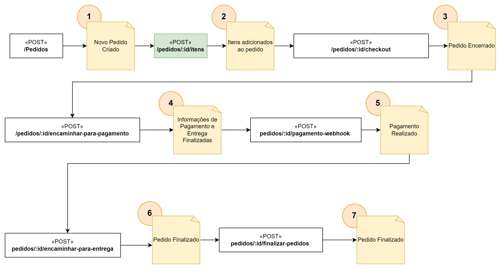

# Inicie um pedido

Com a API Lanchonete da Rua Instalada, algumas tabelas são preenchidas com [valores de demonstração](valores-demonstracao.md):


1) Inicie um novo pedido com o identificador do cliente, a sessão de navegação alguma outra informação como se segue no exemplo:

```
curl -X 'POST' \
  'http://127.0.0.1:5000/pedidos/' \
  -H 'accept: application/json' \
  -H 'Content-Type: application/json' \
  -d '{
        "cliente_id": 1,
        "session_id": "cliente_navegador_1",
        "observacoes": "sem cebola",
        "status": "EM_ATENDIMENTO"
      }'

```

2) Adicione, na ordem que quiser, os produtos no pedido criado, informando o produto e o valor.

```
curl -X 'POST' \
  'http://127.0.0.1:5000/pedidos/1/itens' \
  -H 'accept: application/json' \
  -H 'Content-Type: application/json' \
  -d '{
  "pedido_id": 1,
  "produto_id": 1,
  "quantidade": 2,
  "valor": 40.8
     }'

```

pedidos/encaminhar-para-pagamento - sinaliza pronto para pagar
pedidos/checkout - prepara o pedido para pagamento e entrega
pedidos/pagamento-webhook - Aguarda o pagamento do pagseguro
pedidos/finalizar-pedidos - Finaliza pedido
pedidos/encaminhar-para-entrega - marca como encaminhado para entrega


## Veja também:
[Overview da API](./overview.md)

